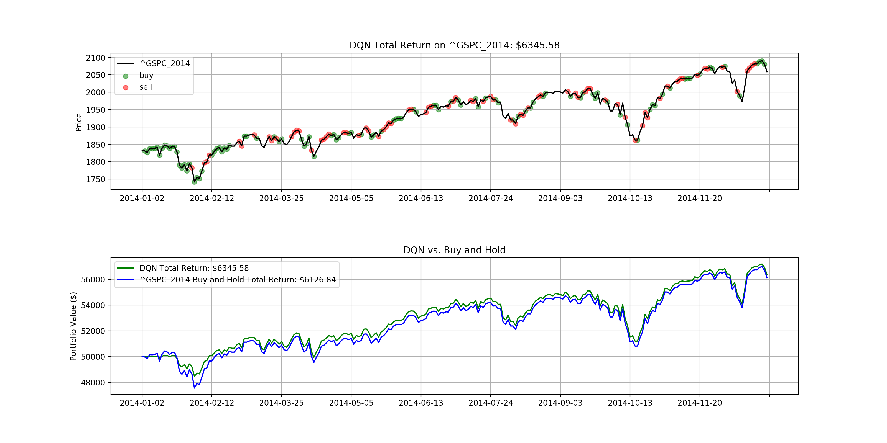
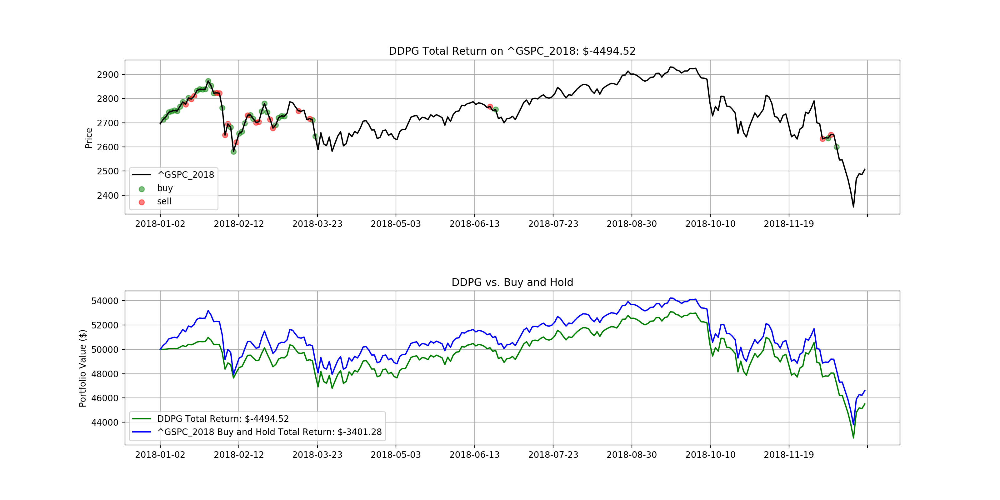

# Deep-Reinforcement-Stock-Trading

This project intends to leverage deep reinforcement learning in portfolio management. The framework structure is inspired by [Q-Trader](https://github.com/edwardhdlu/q-trader). The reward for agents is the net unrealized (meaning the stocks are still in portfolio and not cashed out yet) profit evaluated at each action step. For inaction at each step, a negtive penalty is added to the portfolio as the missed opportunity to invest in "risk-free" Treasury bonds. A lot of new features and improvements are made in the training and evaluation pipelines. All evaluation metrics and visualizations are built from scratch.

Key assumptions and limitations of the current framework:
- trading has no impact on the market
- only single stock type is supported
- only 3 basic actions: buy, hold, sell (no short selling or other complex actions)
- the agent performs only 1 action for portfolio reallocation at the end of each trade day
- all reallocations can be finished at the closing prices
- no missing data in price history
- no transaction cost

Key challenges of the current framework:
- implementing algorithms from scratch with a thorough understanding of their pros and cons
- building a reliable reward mechanism (learning tends to be stationary/stuck in local optima quite often)
- ensuring the framework is scalable and extensible

Currently, the state is defined as the normalized adjacent daily stock price differences for `n` days plus  `[stock_price, balance, num_holding]`.

In the future, we plan to add other state-of-the-art deep reinforcement learning algorithms, such as Proximal Policy Optimization (PPO), to the framework and increase the complexity to the state in each algorithm by constructing more complex price tensors etc. with a wider range of deep learning approaches, such as convolutional neural networks or attention mechanism. In addition, we plan to integrate better pipelines for high quality data source, e.g. from vendors like [Quandl](https://www.quandl.com/); and backtesting, e.g. [zipline](https://github.com/quantopian/zipline).

### Getting Started
To install all libraries/dependencies used in this project, run
```bash
pip3 install -r requirement.txt
```

To train a DDPG agent or a DQN agent, e.g. over S&P 500 from 2010 to 2015, run
```bash
python3 train.py --model_name=model_name --stock_name=stock_name
```

- `model_name`      is the model to use: either `DQN` or `DDPG`; default is `DQN`
- `stock_name`      is the stock used to train the model; default is `^GSPC_2010-2015`, which is S&P 500 from 1/1/2010 to 12/31/2015
- `window_size`     is the span (days) of observation; default is `10`
- `num_episode`     is the number of episodes used for training; default is `10`
- `initial_balance` is the initial balance of the portfolio; default is `50000`

To evaluate a DDPG or DQN agent, run
```bash
python3 evaluate.py --model_to_load=model_to_load --stock_name=stock_name
```

- `model_to_load`   is the model to load; default is `DQN_ep10`; alternative is `DDPG_ep10` etc.
- `stock_name`   is the stock used to evaluate the model; default is `^GSPC_2018`, which is S&P 500 from 1/1/2018 to 12/31/2018
- `initial_balance` is the initial balance of the portfolio; default is `50000`

where `stock_name` can be referred in `data` directory and `model_to_laod` can be referred in `saved_models` directory.

To visualize training loss and portfolio value fluctuations history, run:
```bash
tensorboard --logdir=logs/model_events
```
where `model_events` can be found in `logs` directory.

### Example Results
Note that the following results were obtained with 10 epochs of training only. 




### Frequently Asked Questions (FAQ)
- How is this project different from other price prediction approaches, such as logistic regression or LSTM?
  - Price prediction approaches like logistic regression have numerical outputs, which have to be mapped (through some interpretation of the predicted price) to action space (e.g. buy, sell, hold) separately. On the other hand, reinforcement learning approaches directly output the agent's action.


### References:
- [Deep Q-Learning with Keras and Gym](https://keon.io/deep-q-learning/)
- [Double Deep Q Networks](https://towardsdatascience.com/double-deep-q-networks-905dd8325412)
- [Using Keras and Deep Deterministic Policy Gradient to play TORCS](https://yanpanlau.github.io/2016/10/11/Torcs-Keras.html)
- [Practical Deep Reinforcement Learning Approach for Stock Trading](https://arxiv.org/abs/1811.07522)
- [Introduction to Learning to Trade with Reinforcement Learning](http://www.wildml.com/)
- [Adversarial Deep Reinforcement Learning in Portfolio Management](https://arxiv.org/abs/1808.09940)
- [A Deep Reinforcement Learning Framework for the Financial Portfolio Management Problem](https://arxiv.org/abs/1706.10059)
