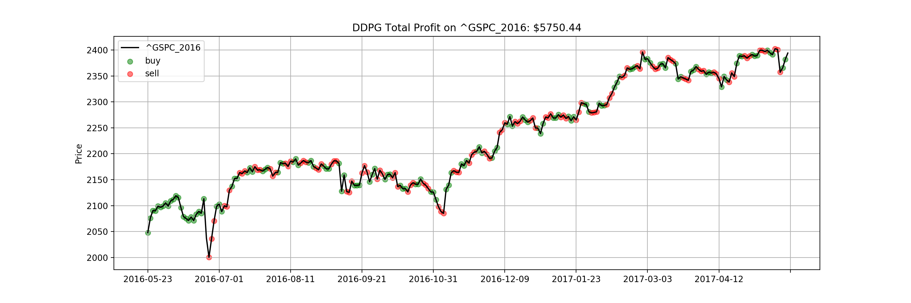

# Deep-Reinforcement-Stock-Trading

This project intends to leverage deep reinforcement learning in portfolio management.

The light-weight Deep Q-network (DQN) is inspired by [Q-Trader](https://github.com/edwardhdlu/q-trader) and the Deep Deterministic Policy Gradient (DDPG) agent structure is adapted from [DDPG-Keras-Torcs](https://github.com/yanpanlau/DDPG-Keras-Torcs).

### Getting Started
To install all libraries/dependencies used in this project, run
```bash
pip3 install -r requirement.txt
```

To train a DDPG agent or a DQN agent (with window size included), e.g. over S&P 500 from 2011 to 2019, run
```bash
python3 train_DDPG.py ^GSPC [epoch number]
python3 train_DQN.py ^GSPC [window size] [epoch number]
```

To evaluate a DDPG or DQN agent, run
```bash
python3 evaluate_DDPG.py [stock symbol] [model name]
python3 evaluate_DQN.py [stock symbol] [model name]
```

where stock symbols can be referred in `data` folder and model names can be referred in `saved_models`.

### Example Results


### References:
- [Deep Q-Learning with Keras and Gym](https://keon.io/deep-q-learning/)
- [Adversarial Deep Reinforcement Learning in Portfolio Management](https://arxiv.org/abs/1808.09940)
- [A Deep Reinforcement Learning Framework for the Financial Portfolio Management Problem](https://arxiv.org/abs/1706.10059)
